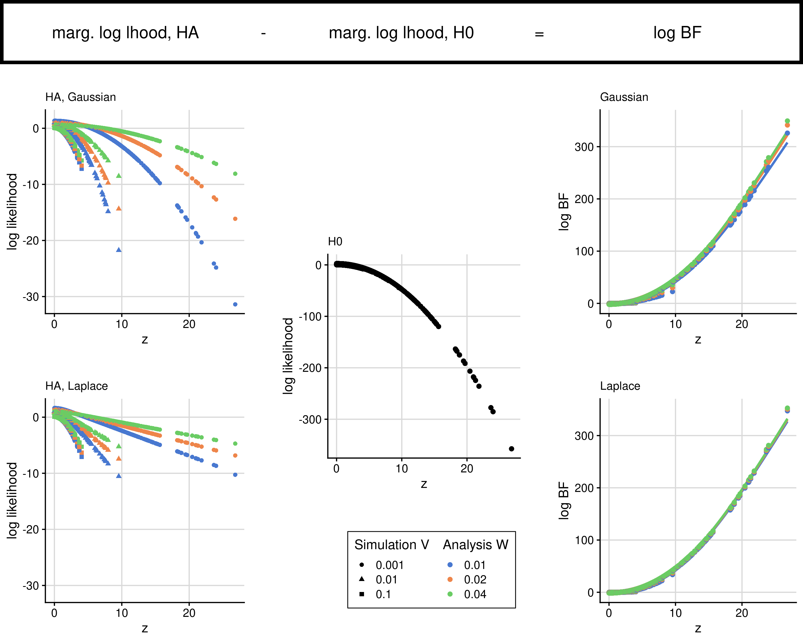

# Methods

# Running the code

## Effect of prior on marginal likelihood and BF

We assume we have data summarising a single regression: \(\hat\beta\), the estimated effect of a genotype on an outcome, and \(\hat V\), its estimated standard error.  We assume \(\hat\beta\) is unbiased, that is \(\hat\beta \sim N(\beta, \hat V)\).

We consider three prior distributions for \(\beta\):

- H0: \(\beta = 0\)
- HN: \(\beta \sim N(0,W)\)
- HL: \(\beta \sim L(0,\lambda)\)

where \(W\) and \(\lambda = \sqrt(W/2)\) are the prior variance of \(\beta\) under HN and HL respectively.

A key quantity in Bayesian fine mapping is the marginal likelihood of an observation

\(\int_\beta L(\hat\beta | \beta ) \pi(\beta) d\beta \)

because the log Bayes factor is calculated as the difference in log marginal likelihoods between the alternative (HN or HL) and the null (H0).

We simulated single \(\hat\beta\) observations with \(\hat V\) set to values in \({0,001, 0.01, 0.1} \) and calculated marginal log likelihood values under each hypothesis for different values of W, and the associated log Bayes factors comparing HN and HL to H0.

```
qR.rb -r ./marg-lhood-bf.R
```


*Log marginal likelihoods (top row) and log Bayes Factors (bottom row) vary with the evidence for association (the absolute z score) and the prior distribution and parameters. However, the overwhelming effect for large z score is the decrease in likelihood under H0, such that log Bayes factors are broadly similar across different priors.* 

## Effect of prior on fine mapping

To examine the effect of these differences for the full fine mapping procedure, we simulated GWAS summary stats, and analysed these under the different prior distributions, and compared the distribution of posterior probabilities at the causal variant across the different analyses.

```
rm ~/scratch/fm-priors/* ## cleanup

for cvtype in friendly lonely; do
    for nn in 2000 5000 10000; do
        qR.rb -r -y 0-9 ./sim.R --args cvtype=$cvtype NN=$nn
    done
done

## wait

qR.rb -r ./collate.R
```


*Effect of different prior choices on the distribution of posterior probabilities at the causal variant under different simulation structures.* We found the distributions were broadly similar across different priors for a range of simulated scenarios. This plot shows the distribution of posterior probabilities at the causal variant across all simulations that reached genome-wide significance. Each distribution is represented by its mean (mid horizontal bar), its 10th and 90th centile (outer horizontal bars) and its 1st and 99th centile (limits of vertical line).  Generally, posterior probabilities are higher when the causal variant is in low LD with other variants in the region, when power is greaters (smaller P value) / larger sample sizes. The choice of prior distribution (Gaussian or Laplace) has very little effect on the distribution of posterior probabilities at the causal variant.  While all datasets were analysed with W=0.04 (the standard approach), this value assumes odds ratios may exceed 1.2 with probability 0.25, which is quite liberal.  We therefore considered datasets simulated from W=0.04 or the more conservative W=0.01 or W=0.02 and found that posterior probabilites did tend to be smaller with more conservative simulations, reflecting the smaller range of effects simulated.


