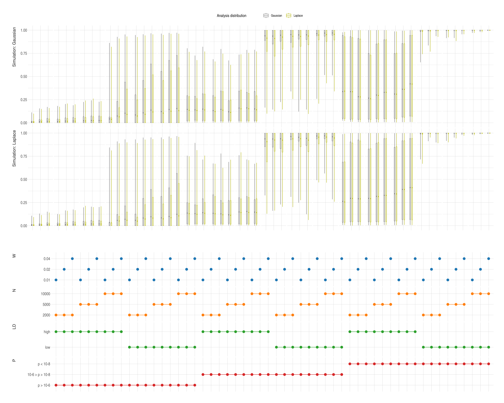

# Summary output

[](Readme.html)

# Effect of prior on marginal likelihood and BF

qR.rb -r ./marg-lhood-bf.R


# Effect of prior on fine mapping

Simulate GWAS summary stats, and analyse under various prior dn or variance, storing PP and PP-rank at the true CV

```{sh}
rm ~/scratch/fm-priors/* ## cleanup

for cvtype in friendly lonely; do
    for nn in 2000 5000 10000; do
        qR.rb -r -y 0-9 ./sim.R --args cvtype=$cvtype NN=$nn
    done
done

## wait

qR.rb -r ./collate.R
```



# Generate summary output

```{sh}
Rscript -e 'rmarkdown::render("Readme.Rmd")'
```
